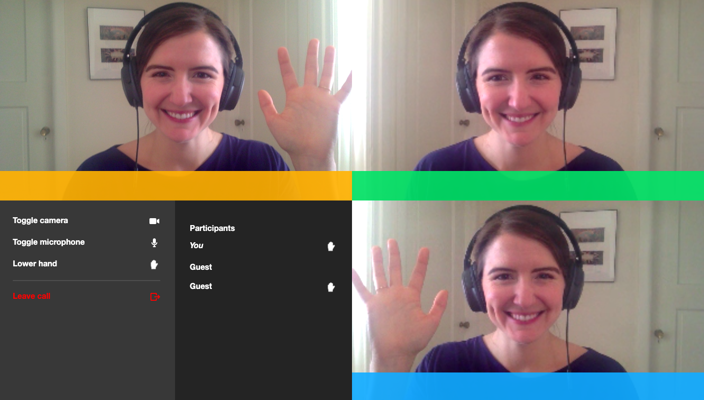

# 🤚 Raise a virtual hand on custom Daily.co video chats
If you've found your way to this post, you might've run into the same problem I did. Maybe you: 

* Teach students in an online classroom, and need a way for them to let you know when they have something to say without talking over each other. 
* Manage public meetings for city supervisors, and want to find a nondisruptive, organized way to allow for public comments. 
* Just want your family catch-up chats to have a little more order. 

In any of these (and many other!) situations, adding a tool to video chats that lets participants raise their hands, and that lets the moderator see everyone waiting to speak, can come in...handy. 

 

This post will walk you through how to use the [Daily.co API](https://docs.daily.co/docs/reference-docs) to implement a Raise Your Hand feature on a custom video chat embedded in your website. 
## How this will work 
We'll wire a website up to the [Daily.co API](https://docs.daily.co/docs/reference-docs), which does some under the hood magic to add video chats to any app or site in minutes. We'll listen for specific Daily.co call events (like when a new user joins) and execute custom callback functions in response. 

To set this all up, you'll want to have a Daily-js account (sign up for one [here](https://dashboard.daily.co/)). I'll assume you already have a website in mind to add this feature to, but, if you don't, you can fork one of [Daily.co's demos on Github](https://github.com/daily-co/daily-demos), or get some ideas for building a website over on [Dev.to](https://dev.to/gaelthomas/how-to-deploy-a-static-website-for-free-in-only-3-minutes-with-google-drive-254c).

If you'd rather head straight to the code, you can check out the [full demo repository](https://github.com/kimberleejohnson/custom-video-call). 

Or, if you'd rather see the demo live in action, head over to [Netlify](https://daily-chat-raise-your-hand.netlify.app/). 

## How to build this 
### Connect to Daily.co 
In the head of the html page where you'll host the call, add the @daily-co script tag. 

Next, inside the `<body>` tag, add an onload function to start the call as soon as someone visits the page: `onload="startCall()"`. We'll write that function soom, but first add the iframe where the Daily.co call will load within the body of the page, making sure it has an id tag. The top of your file should now look something like this: 

With that all set, we can create a `` tag in our body to work with the Daily.co API. A tag within my html file worked faster for me locally than importing a separating .js script, but you could go that route too. 

First, we'll initialize two variables: a boolean to track whether or not a hand is raised `raisingHand`, and an object to pair that status with a user's session_id `handState.` 

With those ready, we can setup `startCall()`. In this function, we'll need to create the DailyIframe, and point it to the appropriate room to join. I hard-coded a url from my [Daily.co dashboard](https://dashboard.daily.co/) to get this demo running quickly, but for full production-ready chats, you'll want to [create a unique room](https://www.daily.co/blog/video-call-api-tutorial-the-rooms-family-of-endpoints). 

We can now call the Daily.co API to create the iframe within our #call-frame element (that's why we needed an id). I added a property to use Daily.co's [custom layout functionality](https://www.daily.co/blog/using-css-grid-to-create-custom-api-video-call-layouts)too, but that's optional. 

With the callFrame initialized, we then tell our function to join the call with `callFrame.join()`. 

You should be able to now refresh the page and enter a call. Now to customizing. 

### React when a user joins a call 
The [Daily.co API](https://docs.daily.co/reference#events) gives us some events we can listen for and react to with custom functions ([callbacks](https://developer.mozilla.org/en-US/docs/Glossary/Callback_function)).

We'll start with `joined-meeting`. When a user joins a meeting, we want to remove their loading screen, and to swap the "Join Call" option for "Leave Call". We can do all of that in a `joinedCall()` function we pass to `joined-meeting`. 

### Let a user raise their hand
I added a Raise Your Hand option to my user's controller list, alongside the microphone and video icons, and connected that hand to an `onclick=toggleHand()` function. 

The function uses `document.getElementById()` to toggle styling based on a user's click, and to then set the `raisingHand` boolean based on whether the hand is raised.

But, that click just controls a user's _own_, or "local" view. To make sure the change they make is visible to all future callers, we need to call Daily.co's `callFrame.sendAppMessage()` to let everyone else know about the change. 

To do something with that information, we'll use the Daily.co `app-message` event, adding a callback function to update our `handState`. I'm calling this one `updateHandState(e)`.  

 

### React when other users join the call 
The `participant-joined` Daily.co event lets us know when another user joins the call. 

We need to do two main things when that happens: add their name to the guest list, and make sure they can see who else is already on the call and has their hand raised. A new user [won't see any messages that were sent before they joined the call](https://docs.daily.co/reference#%EF%B8%8F-sendappmessage). So, when a participant joins, we need to tell every other user on the call to send another message to everyone else about whether or not their hand is raised. 

Our `updateParticipantList(e)` calls Daily.co's `callFrame.participants()` to get all the participants on the call, loop through them and add their .user_name or the placeholder "Guest" to the participant list. It also grabs each participant's .session_id to put as an id on the `` tag. As the last step in the loop, each participant on the call who is not the one who just joined (we get that information from the event `(e)` we passed in), sends a message to all the other callers with their handState. Since a message has been sent, our `updateHandState(e)` runs again. 

### React when users leave the call 
All good things (and video chats) must come to an end. When a user leaves a call, we need to reset their view to display the "Join Call" option, and to remove the list of participants. 

When a user sees another caller leave (on the `participant-left` event), we need to run `updateParticipantList(e)` again so that their name and handState gets removed from the list when they leave. 

And, there you have it! Participants can now raise their hands during your video chat. 

 

### Going further
If you're planning on lots of participants in your call, with lots of hands raised, I recommend using a framework like React to manage all that state. Have a look at [Daily's React demo](https://www.daily.co/blog/building-a-custom-video-chat-app-with-react). And, if you're up for the challenge of getting a Daily.co video chat up on a Gatsby site, please give me a shout at `hello@kimberlee.dev`.  